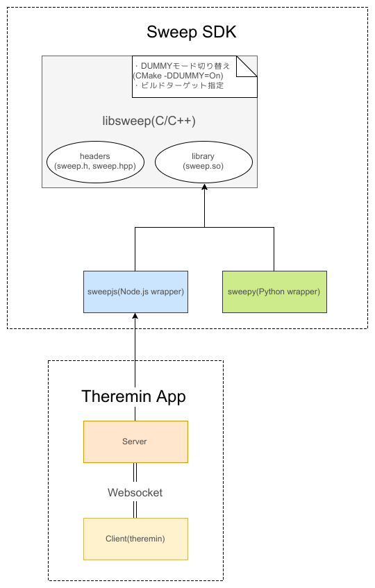

# Sweep Theremin

超小型LiDARデバイス[sweep](http://scanse.io/)でテルミンをつくる :sound:

## Architecture



- このソフトウェアはlibsweep, sweepjsに依存しています。

- このソフトウェアはserver(sweepにAPIを使ってアクセスし、取得した値をWebsocketで配信する)とvisualizer(テルミン)の2つで構成されています。
  - 各ディレクトリには```package.json```が含まれており、それぞれ独立して実行・インストールできます。詳細は各```package.json```のscriptsフィールドを確認してください。

## Requirements

- [Sweep SDK](https://github.com/scanse/sweep-sdk)が動作する環境であること。

- yarnが[インストール](https://yarnpkg.com/lang/en/docs/install/)されていること

## Install

まず、[Sweep SDK](https://github.com/scanse/sweep-sdk)をREADMEに従ってインストールしてください。公式から詳細な記述がないのですが、[こちら](https://hub.docker.com/r/scanse/sweep-sdk/)にひっそりとDocker Imageも提供されています。

SDKをインストールしたら、このリポジトリに移動して、
```npm install```
でインストールしてください。

## Run

実行時には、sweepjsをインストールしたディレクトリを環境変数で指定する必要があります。

``` env SWEEPJS_DIR=$HOME/github/scanse/sweep-sdk/sweepjs npm start ```

などとして実行してください。